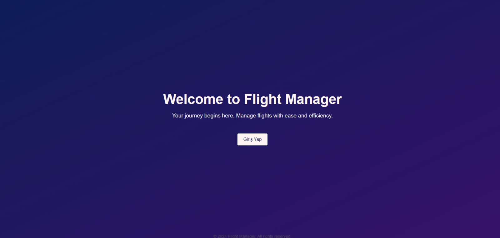
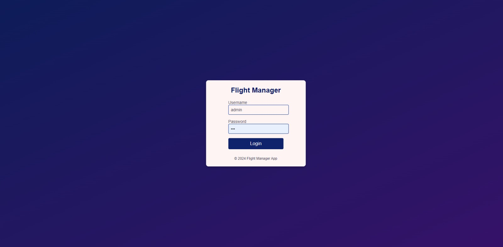
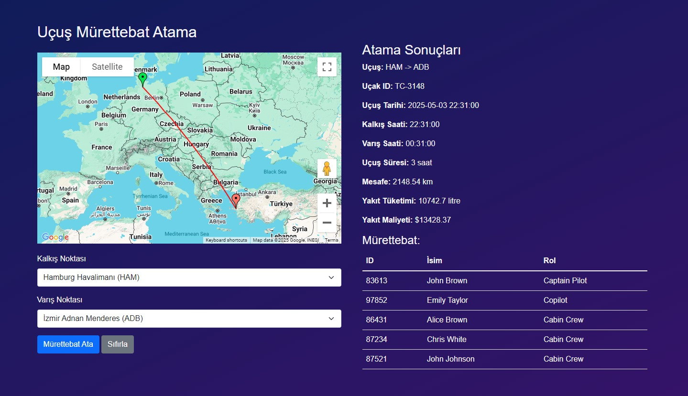

# ✈️ Flight Manager - Uçuş Yönetim Sistemi

Flight Manager, havacılık sektöründe uçuş planlama, mürettebat atama ve uçak yönetimi işlemlerini dijitalleştiren kapsamlı bir web uygulamasıdır. Bu sistem, havayolu şirketlerinin operasyonel verimliliğini artırmak ve uçuş planlama süreçlerini otomatikleştirmek amacıyla geliştirilmiştir.

## 🎯 Projenin Amacı

Flight Manager, havacılık endüstrisindeki karmaşık operasyonel süreçleri basitleştirmeyi hedefler:

- **Operasyonel Verimlilik**: Manuel uçuş planlama süreçlerini otomatikleştirerek zaman tasarrufu sağlar
- **Mürettebat Optimizasyonu**: Çalışma saatleri ve müsaitlik durumlarına göre optimal mürettebat ataması yapar
- **Uçak Yönetimi**: Uçak filolarının kullanımını optimize eder ve bakım planlamasına yardımcı olur
- **Maliyet Kontrolü**: Yakıt tüketimi ve maliyet hesaplamaları ile operasyonel maliyetleri takip eder
- **Güvenlik Standartları**: Havacılık düzenlemelerine uygun çalışma saatleri ve mesafe limitleri uygular

## ✨ Özellikler

### 🛫 Uçuş Planlama
- Google Maps API entegrasyonu ile gerçek zamanlı mesafe hesaplama
- Otomatik uçuş süresi ve yakıt tüketimi hesaplama
- 300km altındaki uçuşlar için güvenlik kısıtlaması
- Rastgele uçuş tarihi ve saat ataması

### 👥 Mürettebat Yönetimi
- Rol bazlı mürettebat atama sistemi (Kaptan Pilot, Yardımcı Pilot, Kabin Ekibi)
- Çalışma saatleri takibi ve aylık limit kontrolü
- Müsaitlik durumu yönetimi
- Otomatik mürettebat optimizasyonu

### ✈️ Uçak Yönetimi
- Uçak müsaitlik durumu takibi
- Aylık çalışma saatleri kontrolü
- Uçak performans optimizasyonu
- Bakım planlaması desteği

### 💰 Maliyet Analizi
- Yakıt tüketimi hesaplama (5L/km)
- Yakıt maliyeti hesaplama (1.25$/L)
- Operasyonel maliyet takibi
- ROI analizi desteği

### 🌐 Web Arayüzü
- Modern ve kullanıcı dostu tasarım
- Responsive web arayüzü
- Gerçek zamanlı veri güncelleme
- Hata yönetimi ve kullanıcı bildirimleri

## 📸 Ekran Görüntüleri

### 1. Ana Sayfa - Uçuş Planlama

*Uçuş planlama ve mürettebat atama ana ekranı*

### 2. Giriş Ekranı

*Kullanıcı girişi için güvenli kimlik doğrulama ekranı*

### 3. Uçuş Planlama Ekranı

*Kalkış ve varış noktaları seçimi ile uçuş planlama arayüzü*

### 4. Başarılı Atama Sonucu

*Mürettebat ve uçak ataması başarılı sonuç ekranı*

### 5. Hata Mesajı - 300km Altı Uçuş

*300km altındaki uçuşlar için güvenlik uyarı mesajı*

## 🛠️ Gereksinimler

- Python 3.12+
- Flask 2.0.1
- SQLAlchemy 1.4.23
- Google Maps API anahtarı
- Docker (opsiyonel)

## 🚀 Kurulum

### 📋 Ön Gereksinimler

- Python 3.12 veya üzeri
- Git
- Google Maps API anahtarı ([Google Cloud Console](https://console.cloud.google.com/)'dan alabilirsiniz)
- Docker (opsiyonel)

### 💻 Yerel Kurulum

#### 1. Projeyi İndirin
```bash
git clone <repository-url>
cd FlightManager/V1
```

#### 2. Sanal Ortam Oluşturun
```bash
# Windows
py -m venv venv
.\venv\Scripts\activate

# macOS/Linux
python3 -m venv venv
source venv/bin/activate
```

#### 3. Bağımlılıkları Yükleyin
```bash
pip install -r requirements.txt
pip install "werkzeug<3.0"
```

#### 4. Google API Anahtarını Ayarlayın
`.env` dosyası oluşturun:
```bash
# .env dosyası
GOOGLE_API_KEY=your_google_api_key_here
```

#### 5. Uygulamayı Başlatın
```bash
python app.py
```

✅ **Başarılı!** Uygulama `http://localhost:5000` adresinde çalışacaktır.

### 🐳 Docker ile Kurulum

#### 1. Docker Desktop'ı Yükleyin
[Docker Desktop](https://www.docker.com/products/docker-desktop/)'ı indirip yükleyin.

#### 2. Projeyi Docker ile Çalıştırın
```bash
# Docker image oluştur
docker build -t flight-manager .

# Container'ı çalıştır
docker run -p 5000:5000 flight-manager
```

#### 3. Docker Compose ile (Önerilen)
```bash
# Tüm servisleri başlat
docker-compose up

# Arka planda çalıştır
docker-compose up -d
```

### 🔧 Yapılandırma

#### Google Maps API Ayarları
1. [Google Cloud Console](https://console.cloud.google.com/)'a gidin
2. Yeni proje oluşturun veya mevcut projeyi seçin
3. "APIs & Services" > "Credentials" bölümüne gidin
4. "Create Credentials" > "API Key" seçin
5. API anahtarını kopyalayın ve `.env` dosyasına ekleyin

#### Veritabanı Yapılandırması
Uygulama SQLite veritabanları kullanır ve otomatik olarak oluşturulur:
- `dbs_in_use/crewlist.db` - Mürettebat verileri
- `dbs_in_use/airplanes.db` - Uçak verileri
- `dbs_in_use/flights.db` - Uçuş verileri

## 📖 Kullanım Kılavuzu

### 🔐 Giriş İşlemi
1. Tarayıcıda `http://localhost:5000` adresine gidin
2. Giriş sayfasında kimlik bilgilerinizi girin:
   - **Kullanıcı Adı**: `admin`
   - **Şifre**: `123`
3. "Giriş Yap" butonuna tıklayın

### ✈️ Uçuş Planlama
1. Ana sayfada uçuş detaylarını girin:
   - **Kalkış Noktası**: Örn. "İstanbul Havalimanı"
   - **Varış Noktası**: Örn. "Frankfurt Airport"
2. "Mürettebat Ata" butonuna tıklayın
3. Sistem otomatik olarak:
   - Mesafe hesaplar (minimum 300km)
   - Uygun mürettebat bulur
   - Uygun uçak seçer
   - Yakıt maliyetini hesaplar

### ⚠️ Önemli Notlar
- **Minimum Mesafe**: 300km altındaki uçuşlar güvenlik nedeniyle reddedilir
- **Mürettebat Ataması**: Sistem otomatik olarak 5 kişilik mürettebat atar:
  - 1 Kaptan Pilot
  - 1 Yardımcı Pilot  
  - 3 Kabin Ekibi
- **Uçak Seçimi**: Müsait ve uygun uçaklar arasından en az kullanılan seçilir

### 🔄 Sistem Yönetimi
- **Sıfırlama**: "Reset" butonu ile tüm atamaları sıfırlayabilirsiniz
- **Durum Takibi**: Mürettebat ve uçak durumları otomatik güncellenir
- **Hata Yönetimi**: Sistem hataları kullanıcı dostu mesajlarla bildirilir

## 🔌 API Endpoints

| Method | Endpoint | Açıklama |
|--------|----------|----------|
| `GET` | `/` | Başlangıç sayfası |
| `GET` | `/login` | Giriş sayfası |
| `POST` | `/login` | Kullanıcı girişi |
| `GET` | `/index` | Ana uçuş planlama sayfası |
| `POST` | `/assign_crew` | Mürettebat ve uçak atama |
| `POST` | `/reset` | Sistem durumunu sıfırlama |

## 🗄️ Veritabanı Yapısı

### Mürettebat Veritabanı (`crewlist.db`)
- **Crew_Data** tablosu
- Alanlar: `crew_id`, `name`, `role`, `current_work_hours`, `max_monthly_hours`, `duty_status`

### Uçak Veritabanı (`airplanes.db`)
- **Airplanes** tablosu
- Alanlar: `plane_id`, `airplane_current_work_hours`, `max_monthly_hours`, `is_available`

### Uçuş Veritabanı (`flights.db`)
- Uçuş geçmişi ve detayları

## 🔒 Güvenlik

### API Anahtarı Yönetimi
Google API anahtarınızı güvenli şekilde saklayın:
```bash
# .env dosyası
GOOGLE_API_KEY=your_google_api_key_here
```

### Güvenlik Önlemleri
- Minimum 300km mesafe kontrolü
- Mürettebat çalışma saatleri limiti
- Uçak kullanım limitleri
- Input validation ve sanitization

## 🛠️ Geliştirme

### Proje Yapısı
```
V1/
├── 📁 screenshots/          # Ekran görüntüleri
├── 📁 templates/            # HTML şablonları
│   ├── baslangic.html
│   ├── index.html
│   └── login.html
├── 📁 dbs_in_use/          # Veritabanı dosyaları
│   ├── crewlist.db
│   ├── airplanes.db
│   └── flights.db
├── 📁 crud_tests/          # Test dosyaları
├── 📁 db_ORIGINAL/         # Orijinal veritabanları
├── 🐍 app.py               # Flask uygulaması
├── 🐍 main.py              # Ana iş mantığı
├── 🐍 google_api_test.py   # Google API entegrasyonu
├── 📄 requirements.txt     # Python bağımlılıkları
├── 🐳 Dockerfile           # Docker yapılandırması
├── 🐳 docker-compose.yml   # Docker Compose
├── 📄 .dockerignore        # Docker ignore kuralları
└── 📄 README.md            # Bu dosya
```

### Katkıda Bulunma
1. Projeyi fork edin
2. Feature branch oluşturun (`git checkout -b feature/amazing-feature`)
3. Değişikliklerinizi commit edin (`git commit -m 'Add amazing feature'`)
4. Branch'inizi push edin (`git push origin feature/amazing-feature`)
5. Pull Request oluşturun

## 📄 Lisans

Bu proje MIT lisansı altında lisanslanmıştır. Detaylar için `LICENSE` dosyasına bakın.

## 👥 Katkıda Bulunanlar

- **Ceren Çokgezer** - Backend & Database
- **Sinem Kuru** - Backend & API Bağlantısı  
- **Ebru Tıraş** - Backend & Frontend

<div align="center">

**⭐ Star this repo if you found it helpful!**

Made with ❤️ by [Ebru Tıraş](https://github.com/ebrutira) & [Sinem Kuru](https://github.com/sinemmkuru) & [Ceren Çokgezer](https://github.com/sinemmkuru)

</div>
