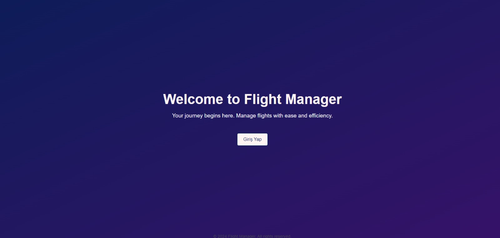
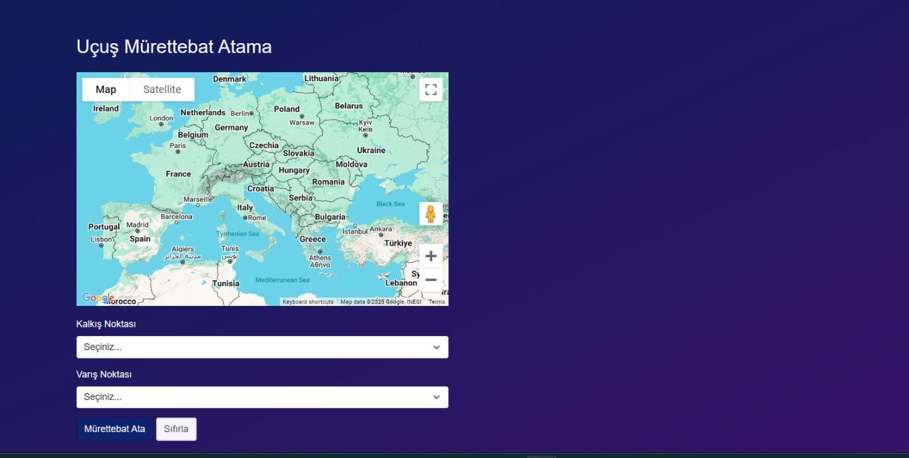
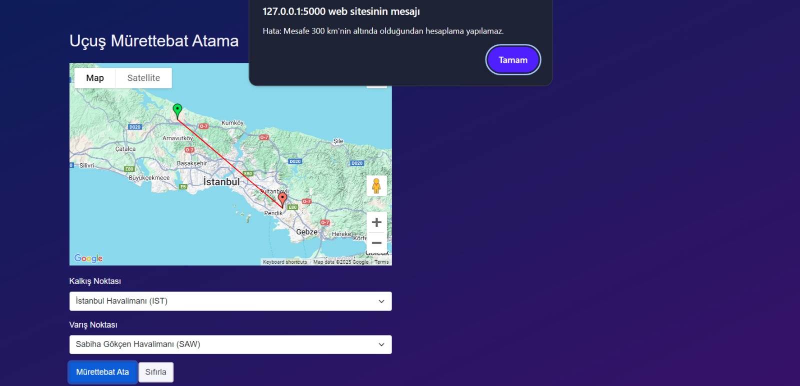

# 📸 Ekran Görüntüleri

Bu klasör, Flight Manager uygulamasının ekran görüntülerini içerir.

## Gerekli Ekran Görüntüleri

Aşağıdaki ekran görüntülerini bu klasöre ekleyin:

1. **login.png** - Giriş ekranı ✅
2. **main.jpg** - Ana sayfa (uçuş planlama) ✅
3. **flight_planning.jpg** - Uçuş planlama ekranı ✅
4. **success_result.png** - Başarılı atama sonucu ✅
5. **error_300km.jpg** - 300km altı uçuş hata mesajı ✅

## Mevcut Görseller

### Giriş Ekranı

*Kullanıcı girişi için güvenli kimlik doğrulama ekranı*

### Ana Sayfa

*Uçuş planlama ve mürettebat atama ana ekranı*

### Uçuş Planlama

*Kalkış ve varış noktaları seçimi ile uçuş planlama arayüzü*

### Başarılı Atama Sonucu

*Mürettebat ve uçak ataması başarılı sonuç ekranı*

### Hata Mesajı - 300km Altı Uçuş

*300km altındaki uçuşlar için güvenlik uyarı mesajı*
